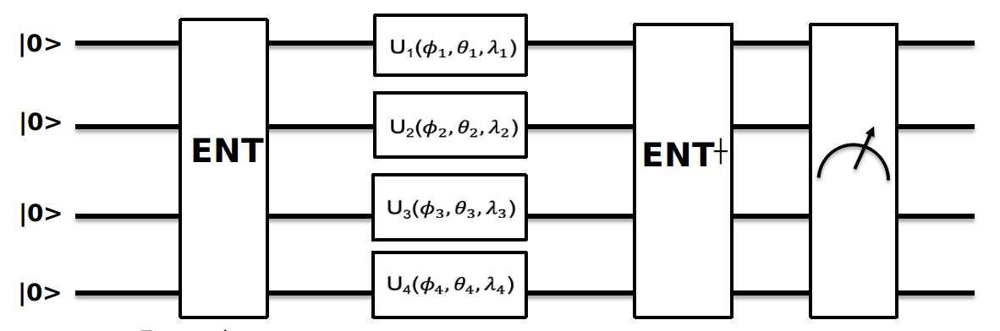

This project refers to the following issue : https://github.com/qiskit-community/qiskit-camp-asia-19/issues/13

# Abstract
The well-being of our global ecosystem is dependent on the shared preservation of global public goods (GPGs). A GPG is a good which cannot be replaced with any other good, and that no one can be theoretically excluded from, such as air or climate change impact. One of the biggest threats to GPG integrity is the free-rider problem, which is a well defined problem in Game theory frame. Is it possible to develop another approach of this issue using quantum entanglement and hence demonstrate on a valuable problem quantum advantage? The answer seems to be yes and it might be possible to show it on a simple case building an efficient algorithm in Qiskit.

# How to use

Our framework optimize a given cost function by finding the corresponding strategy for each player.
The payoff matrix is of size , each column is representing the payoff of a player for each strategy.
A cost function must also be provided, it map the payoff vector to a relevent quantity to optimize.

In the circuit above, the inputs are , this input represent the initial strategy for the player .

In our program these values are set in a vector of named input, we have  where  is the number of players.

Our framework also works for classical strategies.
In this case only one input per player is needed,  where  is the number of players.

